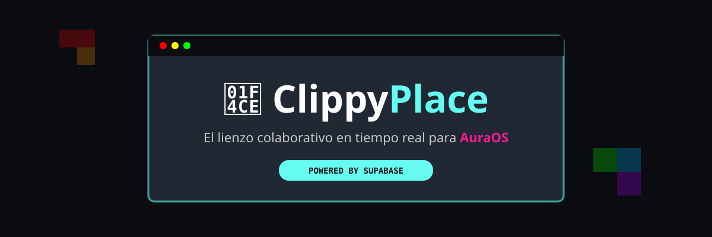

# 📎 ClippyPlace

Un lienzo colaborativo en tiempo real al estilo **r/place**, diseñado e integrado para **AuraOS** y la web abierta. 🎨✨

---

## 🚀 Características Principales

* 🖼️ **Lienzo en Tiempo Real:** Dibuja píxeles y mira los cambios de la comunidad al instante mediante WebSockets de Supabase.
* 🔍 **Zoom & Pan Fluido:** Navega fácilmente por el lienzo con la rueda del ratón o arrastrando la pantalla.
* 🎯 **Coordenadas en Vivo:** Visualización exacta de las posiciones `(X, Y)` en tiempo real.
* 🎨 **Paleta de Colores Flexibles:** Selección rápida de colores principales + selector hexadecimal personalizado.
* ⏱️ **Sistema de Cooldown Anti-Spam:** Temporizador integrado para mantener la experiencia justa.
* 🌐 **Compatibilidad OS:** Diseñado para **Chronioñ Browser** en AuraOS y navegadores modernos.

---

## 🛠️ Tecnologías Utilizadas

* **Frontend:** HTML5 Canvas, CSS3, JavaScript ES6+
* **Backend / Database:** Supabase Realtime (PostgreSQL)
* **Hosting:** GitHub Pages

---

## 👥 Comunidad y Servidor

¡Súmate al servidor de Discord para coordinar construcciones en el lienzo!

---

> *Desarrollado con ❤️ para el ecosistema AuraOS.*
